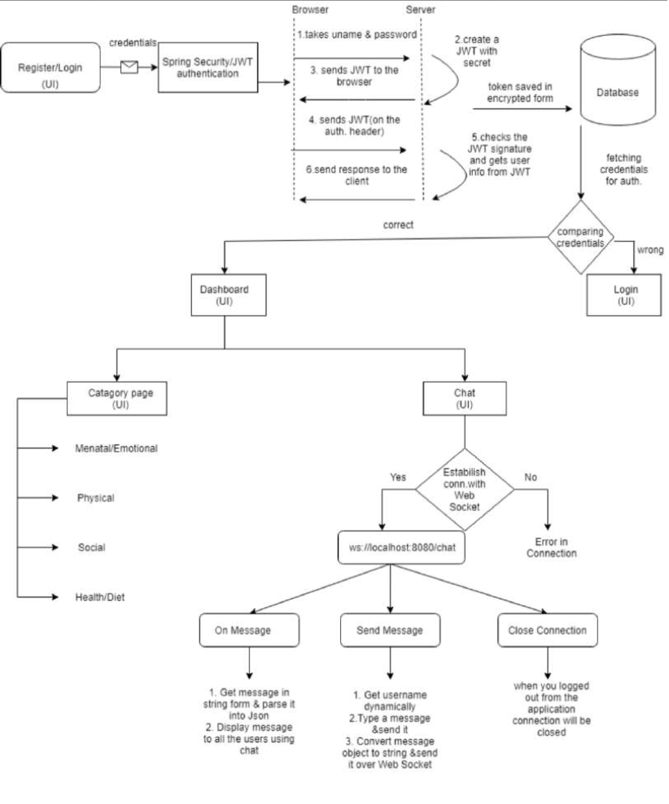

# WeCare
It is a web application that provides health resources and a chat feature for employees to discuss their health issues and concerns. This project combines Spring Security for authenticating JWT tokens during the login process, Angular for front-end development, and WebSocket for the chat feature. The tokens are stored in an encrypted form for enhanced security.

# Features
- User Authentication: Spring Security is used to authenticate JWT tokens when logging in to the portal, ensuring secure access for authorized users. The tokens are saved in an encrypted form, adding an extra layer of security.
- Token Encryption: The JWT tokens are stored in an encrypted form, adding an extra layer of security to protect sensitive user information.
- Dashboard: After successful authentication, users are redirected to the Dashboard. The Dashboard provides access to four categories of health resources: Mental, Physical, Social, and Diet.
- Health Resources: The Dashboard offers four categories of health resources, including Mental, Physical, Social, and Diet. Users can explore these categories to find relevant information and guidance.
- Chat Feature: The portal includes a chat feature that allows users to engage in real-time conversations with other employees in the group regarding their health issues or concerns. The chat feature is implemented using WebSocket technology.

# Technologies Used
- Java
- Spring Security
- JWT (JSON Web Tokens)
- Angular (for front-end development)
- WebSocket (for the chat feature)
- Encryption algorithms (for token encryption)

# Flowchart

# Acknowledgements
We would like to thank all the contributors and developers who have made this project possible. Your efforts and support are greatly appreciated.

